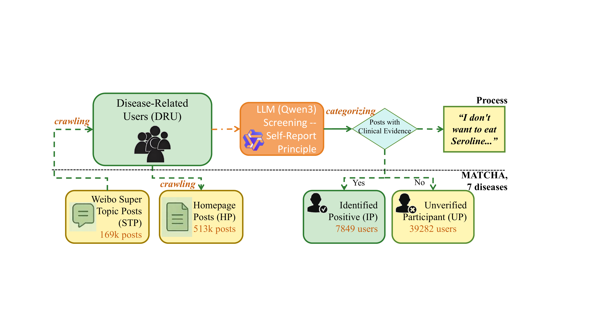

# MATCHA-Mental-Health-Dataset
MATCHA: A Multi-Disease Chinese Mental Health Dataset from Weibo with Cross-Lingual Analyses.

## Introduction
Introducing MATCHA (Multi-Disorder mental health daTa in CHinA), the first large-scale Chinese Weibo dataset covering 7 DSM-5 disorders. It integrates 1.8 million posts from 47k users, linking community-level Super-Topic Posts (STP) with individual-level Homepage Posts (HP).

## Key Features

Community-Driven: Leverages Weibo Super-Topics as organic contexts for mental health discourse.

LLM-Assisted Stratification: Uses Qwen-3 to identify clinically self-reported "Identified Positive" (IP) users with >80% accuracy.

Cross-Lingual Alignment: Fully aligned with the English Twitter-STMHD dataset for comparative research.

## Get Access
To ensure the ethical use of sensitive mental health data, MATCHA is available under a **controlled-access system** for academic and non-commercial research purposes.

### Access Requirements
* **Academic Identity**: Applicants must be affiliated with a university or a recognized research institution.
* **Non-Commercial Commitment**: Users must agree to use the data exclusively for non-profit research.
* **Privacy Compliance**: Users must commit to de-identification protocols and are strictly prohibited from attempting to re-identify any individuals.

## 🟢 How to Get Access

To protect the privacy of mental health subjects, we follow a strict **Dual-Verification** process:

### Step 1: Download & Sign DUA
Download the [DUA.md](./DUA.md) (or PDF version), fill in your information, and sign it.

### Step 2: Email the Application
Send an email to **baihan.li612@gmail.com** with the following:
* **Subject**: [MATCHA Access Request] Your Name - Your Institution
* **Attachment**: The signed DUA file.
* **Content**: Provide the **Email Address** you use for ModelScope/Hugging Face.

### Step 3: Platform Request
Submit an access request on your preferred platform using the **SAME email address** as your signed DUA:
* [ModelScope Request Link](https://www.modelscope.cn/datasets/BaihanLi12/MATCHA_Multi-Disorder_mental_health_daTa_in_CHinA/)
* [Hugging Face Request Link](https://huggingface.co/datasets/emiliememe/MATCHA/)

## Overview of MATCHA

  
   
  <em>Figure 1: Overview of the MATCHA Dataset Collection and Annotation Pipeline.</em>

Symptom Distribution: Weibo shows stronger Anxious/Depressed Mood signals compared to Twitter.

Life Events: Health-centered narratives dominate Weibo's disorder communities (+22.0% higher than Twitter).
